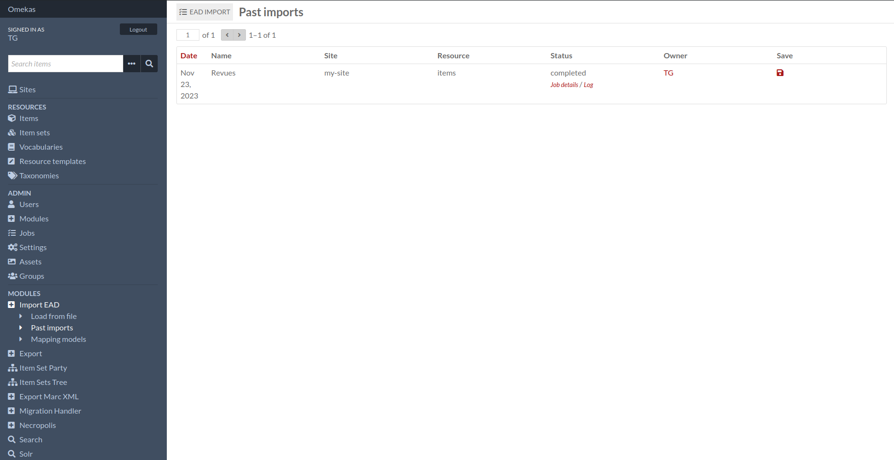
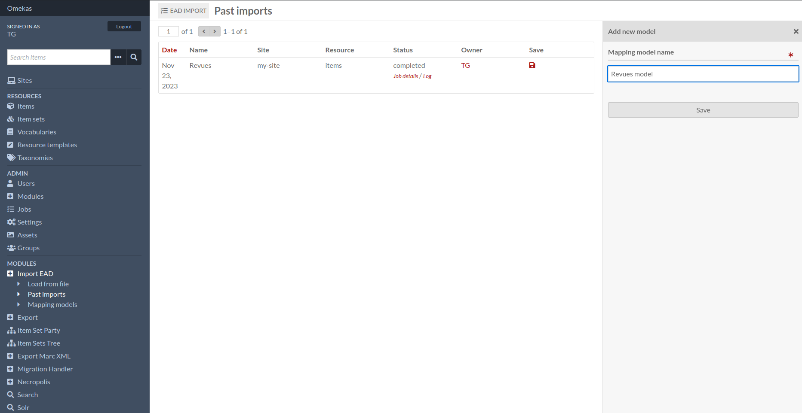
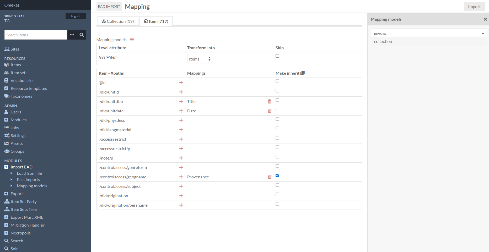
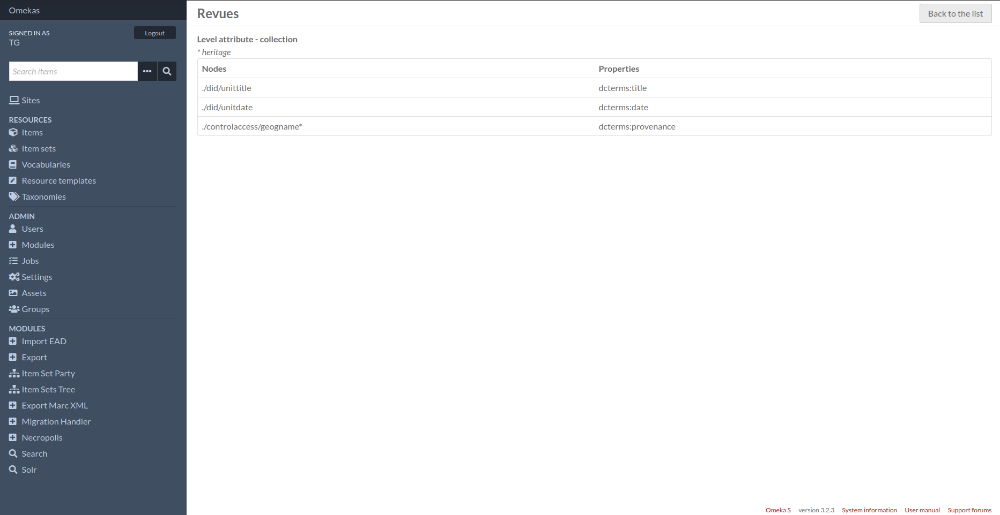

Features
========

Past imports
------------

On this page you'll see past imports, and you'll be able to save the mapping model here.

The template can then be used again when configuring a new import, regardless of the type of resource produced.

Mapping models 
--------------

From this page you can view saved models again, delete them or change their label.

