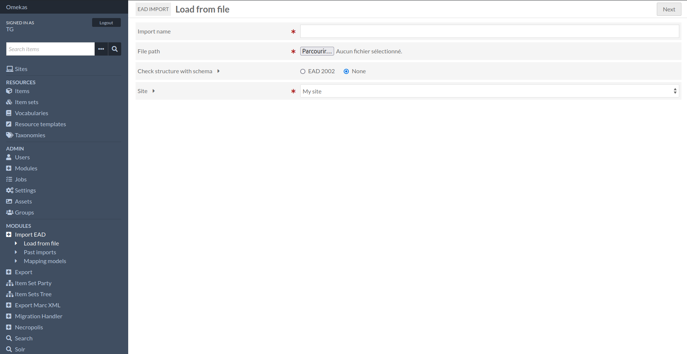
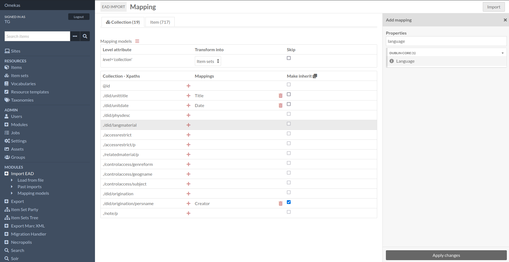
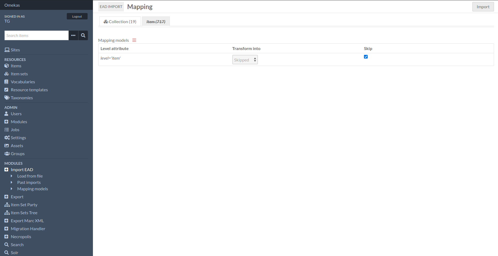

Tutorials
=========

New import configuration
------------------------

When you launch a new import, once you've defined the name and path of the XML file, 
you can check its structure according to the "EAD 2002" schema and assign its content to a particular site.

On submission of this first form you then define the mappings of the xml nodes found (we've specified a node list within the module).
One or more properties can take the value of the selected node. 

Each tab will represent the value of the "`level`" attribute of each `<c>` tag. 
You choose the type of resource produced by each tab, with the option of completely ignoring the tab and the resulting resources.

You also have the option of inheriting properties in child nodes. 

The link between resources is then automatically established by the `dcterms:isPartOf` and `dcterms:hasPart` properties.