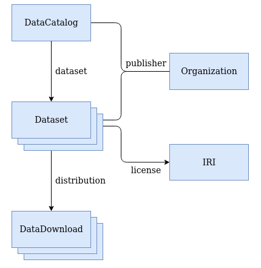

# The conceptual model implemented in the Linked Data Sets module

The [NDE Requirements for datasets](https://netwerk-digitaal-erfgoed.github.io/requirements-datasets/) describes how a dataset description should be defined. The guideline promotes the use of a part of the Schema.org vocabulary (`sdo`) for this purpose.

With this vocabulary aspects like ownership, creators, license, titles, data locations etc. are all described using a [simple conceptual model](https://netwerk-digitaal-erfgoed.github.io/requirements-datasets/#conceptual-model) of 6 key elements: **DataCatalog**, **Dataset**, **Distribution** (or **DataDownload**), **Organization** and **Person** (not shown):

## The conceptual model implemented in Omeka S

The Linked Data Sets module translates the various parts of the conceptual model to Omeka S resources (Items) with the appropiate properties and lists, so that Omeka-S can be used to create the descriptions of a datacatalog, dataset and distribution.

The table below shows how the elements from the guideline correspond to the resource templates which are added by this module.

| Concept in guideline | Usage | Type |  Resource template |
|---|---|---|---|
| DataCatalog | Top element, has collection of Datasets | [sdo:DataCatalog](https://schema.org/DataCatalog) | LDS DataCatalog |
| Dataset | Has links to zero or more Distributions *) | [sdo:Dataset](https://schema.org/Dataset) | LDS Dataset |
| Distribution | Element that references a datadump (file) or data endpoint (API) *) | [sdo:DataDownload](https://schema.org/DataDownload) | LDS Distribution |
| Organization | Element used to represent an organization (for publisher, creator and/or funder) | [sdo:Organization](https://schema.org/Organization) | LDS Organization |
| Person | Element used to represent a person (for publisher, creator and/or funder) | [sdo:Person](https://schema.org/Person) |  LDS Person |

*) When a Dataset has an `sdo:isBasedOn` property which has one (or more) Itemsets as value, the module can crawl this dataset and output the RDF in the (in the Distribution) defined property `sdo:encodingFormat`. See section 2 of the [Usage](Usage.md).